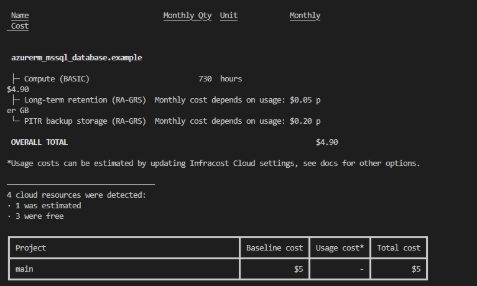

![ref1]

**UNIVERSIDAD PRIVADA DE TACNA** 

**FACULTAD DE INGENIERÍA**

**Escuela Profesional de Ingeniería de Sistemas** 

***Dashboard interactivo para el análisis de tendencias y la visualización de tecnologías aplicables a temas*** 

***de tesis en Ingeniería de Sistemas*** 

Curso: *Inteligencia de Negocios* Docente: *Ing. Patrick Cuadros*

Integrantes: 

***Ayma Choque, Erick Yoel (2021072616) \
Poma Machicado, Fabiola Estefani (2021070030) Tapia Vargas, Dylan Yariet (2021072630)*** 

**Tacna – Perú** 

***2025***

 ![ref2]

**Dashboard interactivo para el análisis de tendencias y la visualización de tecnologías aplicables a temas de tesis en Ingeniería de Sistemas** 
# **Informe de Factibilidad** 
# **Versión *{1.0}*** 

|CONTROL DE VERSIONES ||||||
| - | :- | :- | :- | :- | :- |
|Versión |Hecha por |Revisada por |Aprobada por |Fecha |Motivo |
|1\.0 |MPV |ELV |ARV |
10/10/20

25 
|Versión Original |

**ÍNDICE GENERAL** 

1. [Descripción del Proyecto...........................................................................................................4](#_page3_x85.05_y183.53)** 

   2. [Duración del proyecto..........................................................................................4](#_page3_x85.05_y283.42) 
   2. [Descripción..........................................................................................................4](#_page3_x85.05_y339.37) 
   2. [Objetivos..............................................................................................................4](#_page4_x85.05_y84.96) 
1. [Objetivo general..........................................................................................4](#_page4_x85.05_y106.94) 
1. [Objetivos Específicos..................................................................................4](#_page4_x85.05_y250.77) 
2. [Riesgos.......................................................................................................................................5](#_page4_x85.05_y437.23)** 
3. [Análisis de la Situación actual....................................................................................................5](#_page5_x85.05_y84.96)** 
1. [Planteamiento del problema................................................................................5](#_page5_x85.05_y106.94) 
1. [Consideraciones de hardware y software............................................................6](#_page5_x85.05_y355.06) 
4. [Estudio de Factibilidad...............................................................................................................6](#_page5_x85.05_y587.49)** 
1. [Factibilidad Técnica........................................................................................................... 6](#_page5_x85.05_y615.46) 
1. [Factibilidad Económica......................................................................................................6](#_page8_x85.05_y84.96) 
1. [Costos Generales.......................................................................................6](#_page8_x85.05_y200.83) 
1. [Costos operativos durante el desarrollo..................................................... 7](#_page8_x85.05_y572.01) 

[Estos costos consideran los recursos esenciales para la operatividad del proyecto durante su desarrollo............................................................................ 7](#_page8_x85.05_y613.31) 

3. [Costos del ambiente...................................................................................7](#_page9_x85.05_y100.77) 
3. [Costos de personal.....................................................................................8](#_page9_x85.05_y326.56) 
3. [Costos totales del desarrollo del sistema................................................... 8](#_page9_x85.05_y621.43) [Gran Total: S/ 13,2750.00....................................................................................8](#_page10_x85.05_y153.20) 
3. [Factibilidad Operativa....................................................................................................... 9](#_page10_x85.05_y226.94) 
4. [Factibilidad Legal...............................................................................................................9](#_page10_x85.05_y709.02) 
4. [Factibilidad Social............................................................................................................10](#_page11_x85.05_y290.04) 
4. [Factibilidad Ambiental.................................................................................................... 10](#_page11_x85.05_y552.39) 
5. [Análisis Financiero...................................................................................................................10](#_page12_x85.05_y84.96)** 

[5.1 Justificación de la Inversión...............................................................................10](#_page12_x85.05_y260.75) 

1. [Beneficios del Proyecto............................................................................ 10](#_page12_x85.05_y296.04) 
1. [Criterios de Inversión................................................................................11](#_page13_x85.05_y260.75) 
6. [Conclusiones............................................................................................................................12](#_page14_x85.05_y172.86)** 

**Informe de Factibilidad** 

1. Descripción del Proyecto 
1. Nombre del proyecto 

Análisis de Datos de Tesis Universitarias para Guiar a Estudiantes en la Elección de Temas y Tecnologías 

2. Duración del proyecto 

El proyecto tendrá una duración estimada de 3 meses. 

3. Descripción 

El  presente  proyecto  tiene  como  finalidad  analizar  los  temas,  herramientas  y tecnologías  utilizadas  en  las  tesis  de  grado  de  las principales universidades de Ingeniería  de  Sistemas  en  el  Perú.  A  través  de  un  dashboard  interactivo desarrollado  en  Power BI, se busca identificar las categorías más frecuentes, la evolución  del  uso de tecnologías a lo largo del tiempo y las universidades que destacan en cada área temática. 

Este análisis proporciona una visión clara de las tendencias tecnológicas y patrones de investigación, sirviendo como guía para estudiantes en la elección de temas y tecnologías para sus tesis. Asimismo, ofrece información valiosa para docentes e instituciones  académicas,  permitiendo  una  mejor  alineación  de  los  planes  de estudio  con  las  necesidades  actuales  del  mercado  laboral  y  el  desarrollo tecnológico. 
4. ## Objetivos 
1. ### Objetivo general 
Realizar un análisis de los temas, herramientas y tecnologías empleadas en las tesis de grado de las principales universidades de Ingeniería de Sistemas del Perú, con el fin de identificar tendencias tecnológicas y aportar información útil  para  mejorar  los  programas  académicos  y  alinearlos  con las demandas actuales del mercado laboral. 
2. ### Objetivos Específicos 
- Explorar las categorías temáticas de las tesis y las tecnologías utilizadas en cada una de ellas. 
- Analizar la evolución del uso de tecnologías en las tesis a lo largo del tiempo. 
- Identificar las universidades que destacan en cada categoría de tesis, en función de la producción académica. 
2. Riesgos 
- **Calidad  y  representatividad  de  los  datos**:  Existe  el  riesgo  de  que  las tesis analizadas  no  reflejan  completamente  las  tendencias  actuales del mercado, generando sesgos en el análisis. 
- **Cambios  tecnológicos  rápidos**:  Las  tendencias  tecnológicas  evolucionan constantemente, lo que podría hacer que algunos hallazgos pierdan relevancia en poco tiempo. 
- **Disponibilidad  de  recursos  humanos**:  La  recopilación  y  análisis  de  datos pueden requerir más tiempo y personal del inicialmente previsto. 
3. Análisis de la Situación actual 
1. Planteamiento del problema 

El constante avance tecnológico en el campo de la Ingeniería de Sistemas exige que estudiantes  y  profesionales  se  mantengan  actualizados  con  las  herramientas  y tecnologías más demandadas por el mercado laboral. No obstante, actualmente no existe un análisis sistemático ni centralizado que permita identificar las tecnologías más utilizadas en las tesis de grado de las principales universidades del país. 

Esta  falta  de  información  limita  la  capacidad  de  los  estudiantes  para  tomar decisiones informadas sobre los temas y tecnologías que deberían dominar para incrementar  su  empleabilidad.  Asimismo,  impide  que  docentes  e  instituciones académicas  puedan  ajustar  sus  programas  de  estudio  de  manera  oportuna  y alineada con las tendencias tecnológicas emergentes, reduciendo su capacidad de respuesta frente a las exigencias del entorno profesional. 

2. Consideraciones de hardware y software Hardware 
- Computadora con procesador de al menos Intel Core i5 o AMD Ryzen 5 
- Memoria RAM de 8 GB o superior 
- Almacenamiento de al menos 500 GB SSD 

Software 

- Lenguajes de programación: PYTHON 
- Bases de datos: SQL 
- Herramientas de visualización: Power BI 
4. Estudio de Factibilidad* 
1. Factibilidad Técnica 

El proyecto es técnicamente factible gracias al uso de herramientas modernas y complementarias que permiten un análisis integral de los datos. Se utilizará Power BI como herramienta principal para la integración, transformación y visualización interactiva de la información, facilitando la exploración de tendencias y patrones en las tesis universitarias. 

Los  datos  serán  almacenados  y  gestionados  mediante  Microsoft  SQL  Server, desplegado  en  la  nube  a  través  de  Microsoft  Azure,  lo  que  garantiza  alta disponibilidad, escalabilidad y accesibilidad remota para los distintos componentes del sistema. Esta infraestructura en la nube permite una gestión eficiente, segura y centralizada de los datos. 

Además, se empleará Python para la limpieza, transformación y análisis avanzado de  datos,  lo  que  permitirá  optimizar  la calidad de la información antes de ser visualizada en Power BI. 

Adicionalmente, se contempla el uso de HTML para el diseño de una interfaz web básica o de apoyo, desde donde se podrá acceder a visualizaciones u otros recursos relevantes del proyecto, asegurando compatibilidad con diferentes dispositivos. 

La combinación de estas tecnologías —SQL Server en Azure, Power BI, Python y HTML— permite desarrollar una solución robusta, flexible y alineada con entornos tecnológicos actuales en el ámbito académico y profesional. 

Hardware: 

- Laptop o computadora de escritorio con: 
- Procesador: Intel Core i5/i7 o AMD Ryzen 5/7 
- RAM:  Mínimo  8  GB  (recomendado  16  GB  para  entornos  de  desarrollo  y procesamiento de datos) 
- Almacenamiento: SSD de mínimo 512 GB 
- Infraestructura en la nube a través de Microsoft Azure 

Software: 

- Visual Studio Code (última versión estable) 
- SQL Server Management Studio (SSMS) 
- Power BI Desktop 
- Terraform (última versión estable) 
- Azure CLI 
- Git y GitHub para control de versiones 

Se  empleará  Terraform  como  herramienta  de  Infrastructure  as Code (IaC) para desplegar  de  forma automatizada los recursos necesarios en la nube de Azure, garantizando una gestión reproducible y escalable del entorno. 

Recursos a desplegar: 

- Azure SQL Database (Basic Tier) 
- Azure Blob Storage para respaldos de la base de datos 

El  uso  de  Terraform  facilitará  la  integración  continua  y  el  versionado  de  la infraestructura, promoviendo buenas prácticas de DevOps. 

**Estimación de Costos de Infraestructura en Azure**

|Recurso desplegado con Terraform |Proveedor |Precio mensual (aprox.) |
| - | - | - |
|Azure SQL Database (Basic - 730 h) |Azure |S/. 17.80 |
|Azure Blob Storage (50 GB) |Azure |S/. 7.50 |
|Total mensual estimado ||S/. 25.2 |

2. Factibilidad Económica 

El  propósito  del  estudio  de  viabilidad  económica  es  determinar  los  beneficios económicos del proyecto en relación con los costos asociados. Se evaluarán los recursos  necesarios  para  la implantación y operación del sistema, así como los costos directos relacionados con el desarrollo y mantenimiento del proyecto. 

1. Costos Generales  

Los costos generales incluyen todos los gastos relacionados con accesorios y material de oficina necesarios para los procesos operativos del proyecto. 

|**Accesorios y Materiales** |**Costo mensual** |**Notas** |
| - | :- | - |
|Depreciación de computadoras |600\.00 |Costo anual por equipo |
|Periféricos, accesorios y otros |400\.00 |Teclado, mouse, audífonos, sillas ergonómicas |
|Papelería y material de oficina |100\.00 |Uso mínimo por trabajo remoto |
|Gastos administrativos |200\.00 |software de gestión, etc |

Total Costos Generales: S/ 1,300.00

2. Costos operativos durante el desarrollo  
### Estos  costos  consideran  los  recursos  esenciales  para  la  operatividad  del proyecto durante su desarrollo.  

|**Concepto** |**Costo (S/.)** |**Notas** |
| - | - | - |
|Internet y electricidad |100\.00  x persona/mes |Costo estimado mensual |
|Herramientas  en  la nube |200\.00 |Almacenamiento, CI/CD, APIs, etc. |

Total Costos Operativos: S/ 300.00 por mes 

3. Costos del ambiente 

Incluye los requerimientos técnicos para la implantación del software.

|**Concepto** |**Costo (S/.)** |**Notas** |
| - | - | - |
|Base  de  datos  para perfiles (Azure SQL) |17\.80 |Pago mensual |
|Almacenamiento  de respaldos (Blob 50 GB) |7\.50 |Pago mensual |

Total Costos del Ambiente: S/. 25.20 

4. Costos de personal 

Incluye solo los roles esenciales y con ajustes en los sueldos. 

|**Rol** |**Cantidad** |**Salario Mensual (S/.)** |**Total (S/.) 2 meses** |
| - | - | - | :- |
|Desarrollador Full Stack |1 |2,000.00 |4,000.00 |
|Analista de Datos |1 |1,500.00 |3,000.00 |
|QA Tester |1 |1,500.00 |3,000.00 |
|Líder de Proyecto |1 |2,400.00 |4,800.00 |

Total Costos de Personal: S/ 7,400.00 por mes 

5. Costos totales del desarrollo del sistema  

Se totalizan los costos y se presenta un resumen final del proyecto. 

|**Categoría** |**Costo Total (S/.)** |
| - | - |
|Costos Generales |1,300.00 |
|Costos Operativos (6 meses) |300\.00 |
|Costos del Ambiente |25\.20 |
|Costos de Personal (1 meses) |7,400.00 |
### **Gran Total: S/ 9,025.2** 
3. Factibilidad Operativa 

El sistema permitirá recopilar, analizar y visualizar datos de tesis universitarias en Ingeniería de Sistemas a través de herramientas modernas como Power BI, SQL y Python. Esto facilitará la toma de decisiones informadas para estudiantes, docentes y universidades. 

**Beneficios clave:** 

- Información  estructurada  y  accesible:  Permite  visualizar  tecnologías, herramientas  y  temas  más  utilizados  en  las  tesis  de  diferentes universidades. 
- Dashboard interactivo: Facilita el análisis visual de tendencias mediante Power BI. 
- Automatización del análisis: Gracias al uso de Python y SQL, se reduce el esfuerzo manual en el procesamiento de datos. 
- Actualización  periódica:  Es  posible  actualizar  los  datos  y  gráficos conforme se agreguen nuevas tesis, garantizando relevancia continua. 

**Consideraciones:** 

- El  sistema  requerirá  personal  técnico  capacitado  para  mantener actualizada la base de datos, asegurar el funcionamiento del dashboard y mantener la infraestructura en Azure. 
- Será  necesaria  una  estrategia  de  mantenimiento  periódico  de  la infraestructura y los datos. 

**Interesados clave:** 

- Estudiantes de Ingeniería de Sistemas. 
- Docentes y asesores de tesis. 
- Universidades y facultades. 
- Analistas de educación superior y mercado laboral. 
4. Factibilidad Legal 

El  uso  de  tesis  universitarias  como  fuente  de datos debe realizarse dentro del marco legal peruano. 

**Consideraciones legales:** 

- Datos públicos: Solo se trabajará con tesis de acceso público, disponibles en repositorios institucionales. 
- Propiedad  intelectual:  Se  respetarán  los  derechos  de  autor;  no  se copiarán textos completos, solo se analizarán metadatos como título, resumen, tecnologías y universidad. 
- Ley de Protección de Datos Personales (Ley N° 29733): No se utilizarán datos  sensibles  como  nombres  completos  de  autores o asesores sin consentimiento. 
- Normativas institucionales: Se revisarán las políticas de cada universidad para garantizar el uso permitido de sus repositorios. 
5. Factibilidad Social 

El impacto social del proyecto es positivo y directo sobre la calidad educativa. 

**Beneficios sociales:** 

- Apoyo al estudiante: Facilita una elección más informada de temas de tesis, basados en análisis de datos reales. 
- Actualización  académica:  Brinda  a las universidades una herramienta para ajustar sus mallas curriculares a las tendencias tecnológicas. 
- Transparencia  y  democratización  de  la  información:  Permite  acceso público y equitativo a análisis relevantes del ámbito académico. 

**Riesgos sociales:** 

- Posible  desigualdad  si  el  acceso  a  la herramienta se limita a ciertos grupos. 
- Solución:  Publicar  el  dashboard  de  forma  abierta  o  mediante  una plataforma web accesible. 
6. Factibilidad Ambiental 

El proyecto tiene un impacto ambiental mínimo, ya que opera totalmente en el entorno digital. 

**Acciones sostenibles:** 

- Reducción del uso de papel: Se fomenta el análisis digital de documentos en lugar de impresiones físicas. 
- Uso  eficiente  de  recursos  en  la  nube:  El  sistema  se  implementará  sobre servicios de Azure con escalabilidad, lo que evita el sobredimensionamiento de infraestructura. 
- Concienciación digital: El equipo promoverá buenas prácticas de sostenibilidad digital. 
5. Análisis Financiero 

El plan financiero se ocupa del análisis de ingresos y gastos asociados al proyecto, considerando  el  momento  en el que estos se producen. Su misión principal es detectar situaciones financieramente inadecuadas y prever los recursos necesarios para la correcta implementación y sostenibilidad del sistema. 

En este caso, el proyecto “Análisis de Datos de Tesis Universitarias para Guiar a Estudiantes en la Elección de Temas y Tecnologías” no tiene como objetivo generar ingresos directamente, ya que se orienta principalmente al beneficio académico. Sin embargo, es fundamental estimar los costos relacionados con la infraestructura, herramientas y recursos humanos necesarios. 

5.1 Justificación de la Inversión 
1. ### *Beneficios* del Proyecto 
   El presente proyecto aporta beneficios tanto tangibles como intangibles para los estudiantes, docentes e instituciones académicas vinculadas a la Ingeniería de Sistemas. Si bien no se trata de un proyecto con fines de lucro directo, el beneficio puede entenderse como el valor generado por la mejora en la toma de decisiones, la alineación con el mercado laboral y la eficiencia en el uso de recursos educativos. 

- Beneficios Tangibles: 
- Reducción del esfuerzo manual en la búsqueda de información sobre tendencias tecnológicas en tesis, gracias a la automatización del análisis. 
- Optimización del uso del recurso humano académico, al proporcionar una herramienta de apoyo para asesoramiento de tesis y actualización curricular. 
- Ahorro  en tiempo y costos relacionados con el diseño de programas académicos, ya que se dispone de información actualizada para orientar dichos planes. 
- Mayor  eficiencia  en  la  identificación  de  temas  de  investigación pertinentes,  reduciendo  el  tiempo  de  exploración  por  parte  de  los estudiantes. 
- Beneficios Intangibles: 
- Disponibilidad  de  información  apropiada  y  confiable  sobre el estado actual de la investigación universitaria en Ingeniería de Sistemas. 
- Apoyo  en  la  toma  de  decisiones  estratégicas  para  universidades  al momento de actualizar mallas curriculares, con base en datos reales y tendencias. 
- Fomento de la innovación académica, ya que se visibilizan tecnologías emergentes y áreas de desarrollo que antes pasaban desapercibidas. 
- Incremento  en  la  empleabilidad  de  los  egresados,  al  orientar  la formación hacia las herramientas más utilizadas y demandadas en el mercado laboral. 
- Mejor servicio educativo al estudiante, ofreciendo orientación basada en evidencia concreta y actualizada. 
- Fortalecimiento de la competitividad académica de las universidades, al contar con un recurso que mejora la planificación y evaluación de sus líneas de investigación. 
- Valor  agregado  al  proceso  de  formación  profesional,  al  permitir decisiones más acertadas en la elección del tema de tesis. 
2. ### Criterios de Inversión 
1. #### *Relación Beneficio/Costo (B/C)* 
   *Se estima que los beneficios generados por el proyecto (por su impacto  académico,  eficiencia  en asesoramiento, reducción de esfuerzos y alineación curricular) equivalen a aproximadamente S/ 15,000.00 en valor tangible e intangible durante el primer año de uso.* 

   *Beneficio estimado: S/ 15,000.00 Costo total del proyecto: S/ 9,025.20 Relación B/C = 15,000 / 9,025.2 ≈ 1.66* 

   *Interpretación:  Dado  que  la  relación  beneficio/costo es mayor que 1, se concluye que el proyecto es económicamente viable y recomendable para su implementación.* 
2. #### *Valor Actual Neto (VAN)* 
   *Asumiendo un horizonte de evaluación de 2 años, con beneficios constantes de S/ 15,000 anuales y una tasa de descuento o costo de  oportunidad  del  12%  (0.12),  el  cálculo  del  VAN  sería: s/16.324.8* 

   *Interpretación: Como el VAN es mayor que cero, el proyecto es rentable y debe aceptarse.* 
3. #### *Tasa Interna de Retorno (TIR)* 
   *Calculando la TIR a partir de los flujos netos de S/ 15,000 anuales por 2 años frente a un costo inicial de S/ 9,025.20, se obtiene:* 

   *TIR ≈ 87.6%* 

   *Interpretación:  Como  la  TIR  es  muy  superior al COK (12%), el proyecto genera alta rentabilidad y es altamente recomendable desde el punto de vista financiero.* 

6. Conclusiones 

El desarrollo del proyecto “Análisis de Datos de Tesis Universitarias para Guiar a 

Estudiantes en la Elección de Temas y Tecnologías” ha demostrado ser técnica y financieramente viable. El uso de herramientas modernas como Power BI, Python y SQL Server en Azure permitió estructurar una solución sólida, escalable y alineada con  los  requerimientos  actuales  del  análisis  de  datos,  lo  cual  garantiza  una implementación eficiente y sostenible. 

A  nivel  académico,  el  proyecto  representa  una  solución  de  alto  valor  para  los 

estudiantes de Ingeniería de Sistemas, ya que les proporciona información clara y actualizada  sobre las tendencias temáticas y tecnológicas presentes en las tesis universitarias. Esto les permite tomar decisiones informadas al momento de elegir su  tema  de  investigación,  alineando  su trabajo con las demandas del mercado laboral y los avances tecnológicos recientes. 

Asimismo, se identificaron beneficios tangibles como la reducción de tiempo en la 

búsqueda  de  información,  optimización  del  uso  de  recursos  y  mejora  en  la planificación  académica.  De igual forma, los beneficios intangibles incluyen una mejor toma de decisiones por parte de los estudiantes, docentes y autoridades académicas,  así  como  un  mayor  alineamiento  entre  la  oferta  educativa  y  las necesidades del entorno profesional. 

Desde el punto de vista financiero, el proyecto demuestra su rentabilidad con una 

Relación Beneficio/Costo de 1.66, un Valor Actual Neto (VAN) de S/ 16,324.80 y una Tasa Interna de Retorno (TIR) de 87.6%, indicadores que superan los umbrales de aceptación establecidos y confirman que la inversión es justificable y conveniente. 

Finalmente, este sistema sienta las bases para futuras investigaciones o desarrollos 

similares que puedan aplicarse a otras carreras profesionales o universidades del país. De este modo, contribuye no solo a la mejora de la formación académica, sino también al fortalecimiento del vínculo entre la educación superior y las exigencias del mundo laboral y tecnológico actual. 
16 

[ref1]: media/Aspose.Words.8e9d2a6e-b948-4052-b037-85b55787c01c.001.png
[ref2]: media/Aspose.Words.8e9d2a6e-b948-4052-b037-85b55787c01c.003.png
