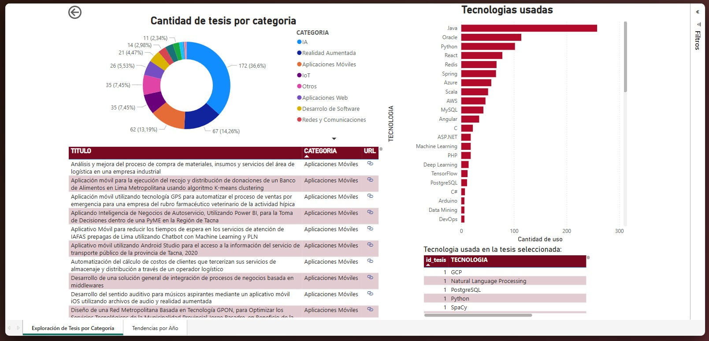
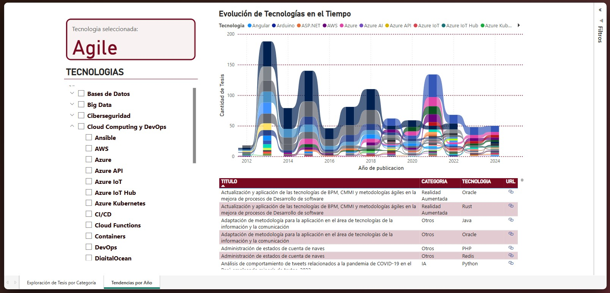

# 🎓 Título del Proyecto

**Dashboard interactivo para el análisis de tendencias y la visualización de tecnologías aplicables a temas de tesis en Ingeniería de Sistemas**

---

## ❗ Problemática

Muchos estudiantes universitarios enfrentan dificultades al momento de elegir un tema de tesis y las tecnologías adecuadas para su desarrollo. Esta situación se debe a la falta de acceso a información organizada y visual sobre los trabajos realizados en años anteriores.

### 📌 Consecuencias

- Dificultad para elegir un tema de tesis alineado con las tendencias tecnológicas.
- Incertidumbre sobre qué tecnologías son más utilizadas en el entorno académico.
- Falta de referentes claros sobre cómo se aplican ciertas herramientas en proyectos reales.

---

## 🎯 Objetivo Principal

-Permitir la visualización clara de la cantidad de tesis por categoría, titulos de tesis filtrados y las tecnologías utilizadas en cada una.

---

## ✅ Objetivos Secundarios

- Analizar la evolución temporal del uso de tecnologías en las tesis para identificar tendencias y cambios significativos a lo largo del tiempo.

---

## 📊 Dashboard Interactivo

Accede al dashboard de Power BI para explorar las visualizaciones y análisis de datos:

🔗 **[Ver Dashboard en Power BI](https://app.powerbi.com/groups/me/reports/ff558cdc-1051-474b-9992-e91c2c06a806?ctid=b6b466ee-468d-4011-b9fc-fbdcf82ac90a&pbi_source=linkShare)**

---

## 👥 Integrantes

| Nombre                              | Código      |
| ------------------------------------ | ----------- |
| Erick Yoel Ayma Choque               | 2021072616  |
| Fabiola Estefani Poma Machicado      | 2021070030  |
| Dylan Yariet Tapia Vargas            | 2021072630  |

---

## 🛠️ Tecnologías Utilizadas

- Microsoft Power BI 📊
- SQL Server